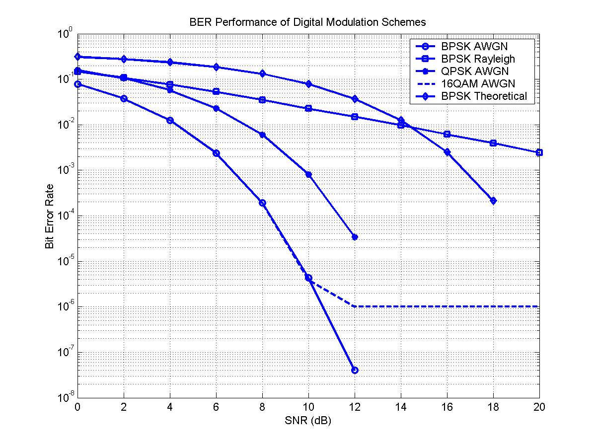

# Wireless-Channel-BER-Simulator

A **MATLAB-based wireless communication simulator** that analyzes the performance of digital modulation schemes under noisy and fading wireless channels using **Bit Error Rate (BER) vs Signal-to-Noise Ratio (SNR)** analysis.

This project models a simplified digital communication system and evaluates the reliability of various modulation techniques.

---

## Features

### Digital Modulation Simulation
- **BPSK (Binary Phase Shift Keying)**
- **QPSK (Quadrature Phase Shift Keying)**
- **16-QAM (Quadrature Amplitude Modulation)**

### Wireless Channel Modeling
- **AWGN (Additive White Gaussian Noise)**
- **Rayleigh Fading Channel**

### Performance Analysis
- **BER vs SNR evaluation**
- **Comparison between simulated and theoretical performance**

### Monte Carlo Simulation
- Multiple simulation trials to obtain reliable BER estimates.

### Visualization
- Log-scale **BER performance plots**
- Comparison between modulation schemes.

---

## Communication System Model

The simulated communication system follows the standard digital transmission chain:

```text
Random Bit Generation
        ↓
Digital Modulation
(BPSK / QPSK / 16-QAM)
        ↓
Wireless Channel
(AWGN / Rayleigh)
        ↓
Receiver Detection
        ↓
Bit Error Rate Calculation
        ↓
BER vs SNR Performance Analysis
```

---

## Performance Metric

Communication reliability is measured using **Bit Error Rate (BER)**.

```
BER = (Number of erroneous bits) / (Total transmitted bits)
```

Lower BER indicates more reliable communication.

---

## Theoretical BER for BPSK

The theoretical BER for BPSK in an AWGN channel is given by:

```
BER = 0.5 * erfc( sqrt(Eb / N0) )
```

The simulator compares simulated BER with the theoretical curve to validate the communication model.

---

## Simulation Results
```
BER vs SNR Performance Analysis
```



```
### Observations

- **BPSK and QPSK** show similar BER performance in AWGN channels.
- **16-QAM** has higher BER because higher-order modulation is more sensitive to noise.
- **Rayleigh fading** significantly degrades communication reliability.
- Simulated BPSK results closely match the theoretical BER curve.

---

## Technologies Used

- **MATLAB**
- Digital Communication Theory
- Monte Carlo Simulation
- Signal Processing

---

## Repository Structure

```
wireless-channel-ber-simulation
│
├── src
│   └── main_simulation.m
│
├── figures
│   └── ber_plot.png
│
├── results
│   └── ber_data.mat
│
└── README.md
```

---

## Future Improvements

Possible extensions of the project:

- OFDM system simulation  
- MIMO wireless communication  
- Adaptive modulation schemes  
- Performance comparison for higher-order QAM  

---

## Author

**Sattwik Dhara**  
B.Tech – Electronics and Communication Engineering  
Haldia Institute of Technology  

GitHub:  
https://github.com/Sattwik-8
